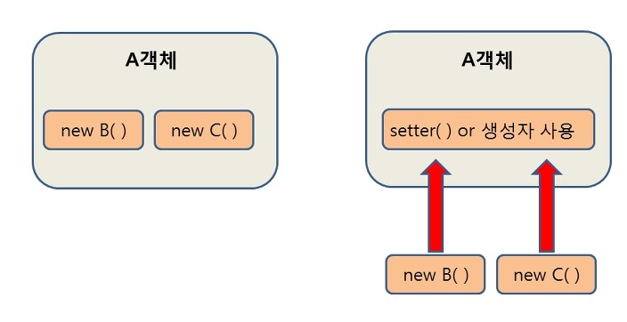
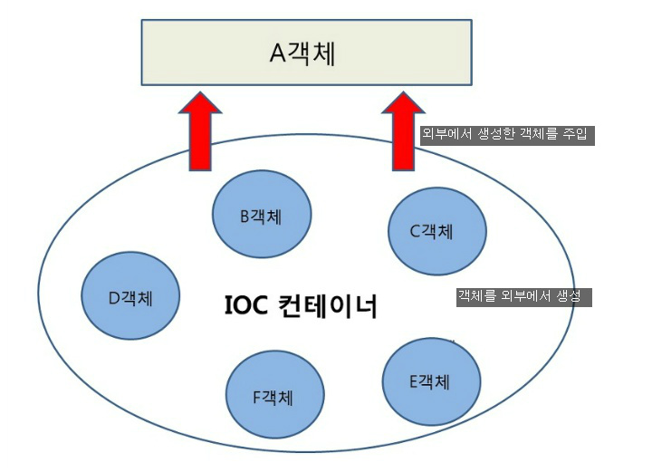

## 스프링 수업
### DI (Dependency Injection)
- DI은 스프링이 다른 프레임 워크와 차별화되어 제공하는 의존 관계 주입 기능
- 객체를 직접 생성하는 게 아닌 외부에서 생성한 후 주입시키는 방식
- DI 의존선 주입을 통해 모듈 간의 결합도가 낮아지고 유연성이 높아짐

- 첫번재 방법은 A객체가 B와 C 객체를 New 생성자를 통해 직접 생성
- 두번째는 외부에서 생성된 객체를 `setter()`를 통해 사용
  - 의존성의 주입 예시로써 A객체에서 B, C 객체를 사용할때 A에서 직접 생성하는 것이 아닌 IoC컨테이너에서 생선된 객체를 주입시켜 setter 또는 생성자를 통해 사용하는 방식
  
- 스프링에서는 객체를 **Bean**이라고하며 프로젝트가 실행될때 사용자가 Bean으로 관리하는 객체들의 생성과 솔멸에 관련된 작업을 자동적으로 수행해주는데 객체가 생성되는 곳을 스프링에서는 Bean 컨테이너라고 함

### IoC (Inversion of Control)
- 제어의 역전 이라는 의미로 말 그대로 메소드나 객체의 호출 작업을 개잘자가 결정하는 것이 아닌, 외부에서 결정되는 것을 의미
- IoC는 제어의 역전이라고 말하며 간단히 "제어의 흐름을 바꾼다"라는 의미
- 객체의 의존성을 역전시켜 객체간 결합도를 줄이며 가독성, 코드 중복, 유지 보수 편하게 가능
- 기존에 객체 생성
  1. 객체 생성
  2. 의존성 객체 생성
    (클래스 내부에서)
  3. 의존성 객체 메소드 호출
  ```java
  public class A {
    private B b;
    A(){
      b = new B();
      }
    }
  ```
- 스프링에서의 객체 생성
  1. 객체 생성
  2. 의존성 객체 주입
    (스스로 만드는것이 아닌 제어권을 스프링에게 위임하여 스프링이 만들어놓은 객체 주입)
  3. 의존성 메소드 호출
    ```java
  public class A {
      private B b;
      public void setB(B b) {
          this.b = b;
      }
    }
  ```
- 스프링이 모든 의존성 객체를 스프링이 실행될때 다 만들어주고 필요한 곳에 주입 시키면서 Bean들은 싱클턴 패턴의 특징을 가짐
